# Nobby Chat App
In this application project; An application has been developed that allows users to chat with each other.
The application opens with the Login and Sign Up pages, where the user can login or register to the application. The user is greeted with the main screen after entering the appropriate information. Here, the user sees chats and the stories shared by other users registered in the application. You can view them by pressing the stories. You can also send a message to a new contact by pressing the message button with the + symbol.
The user can see instant messages or previous messages from the chat section. The user reaches the message page by pressing a desired chat. Here you can see incoming instant messages and reply or start a conversation. On this screen, the user can also share location.
The user can switch to the profile screen where can change personal information and profile picture. Here the user can change the theme to light and dark. User can also log out of account by pressing the sign out button.

## Features to be Improved in Future Versions
- Add a friend
- Sending a picture message
- Sending a file
- Instantly seen
- Sorting the stories by seen
- Seeing the viewers of the story

## Used technologies
- Expo CLI
- React Native Navigation
- Redux Toolkit
- Firebase Authentication
- Firebase Firestore
- Firebase Storage
- Expo Image Picker
- Expo Location
- Expo Linear Gradient
- Expo Splash Screen
- React Native Maps
- React Native Modal
- React Native Root Toast
- React Hook Form
- React Native Vector Icons
- React Native Async Storage

## Screen Videos
https://user-images.githubusercontent.com/48411349/194715820-db55058e-daeb-499c-aec8-ae7f27039655.mp4

https://user-images.githubusercontent.com/48411349/194715469-edb07d31-7fd2-45f3-aa0f-91bd7180dbea.mp4

## Screen Shots
<div>
<kbd>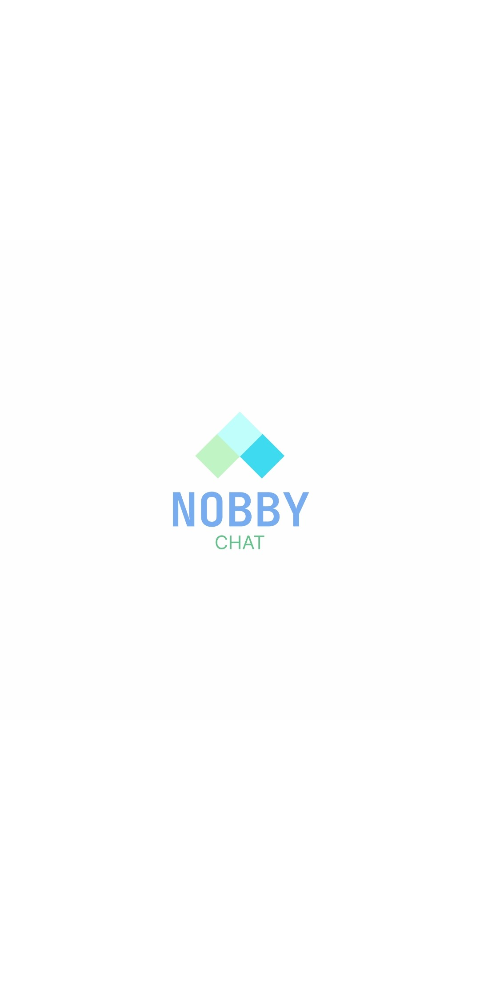</kbd>
<kbd>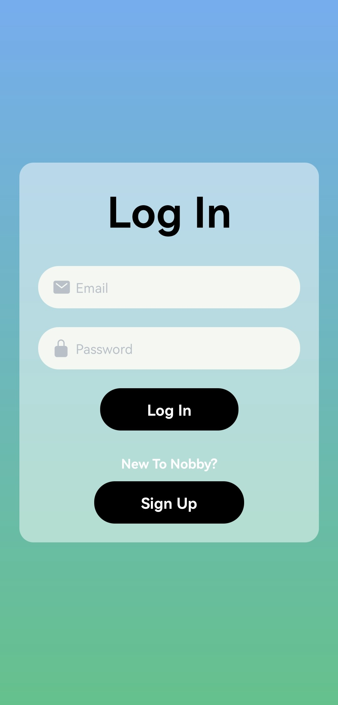</kbd>
<kbd>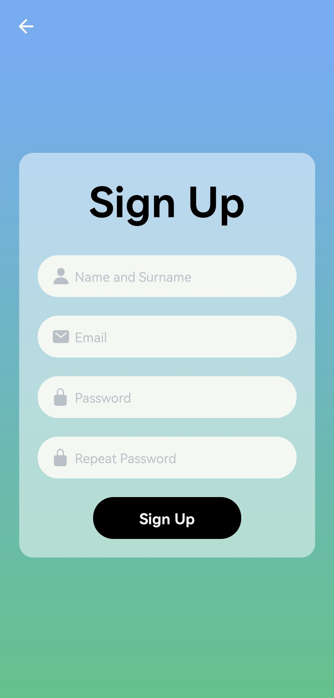</kbd>
</div>
<div>
<kbd>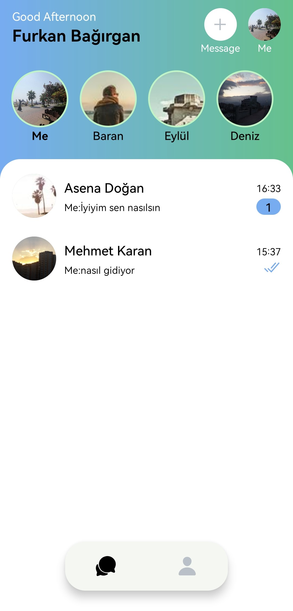</kbd>
<kbd>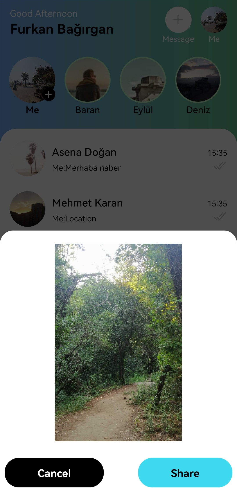</kbd>
<kbd>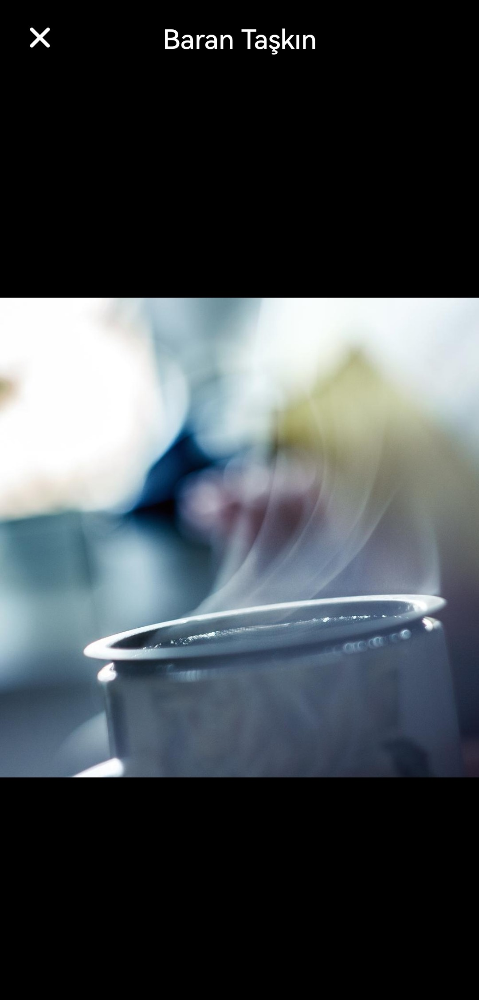</kbd>
</div>
<div>
<kbd>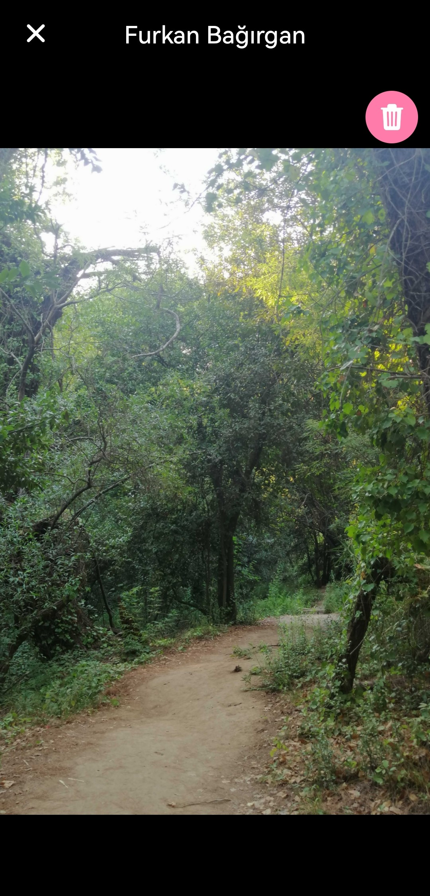</kbd>
<kbd>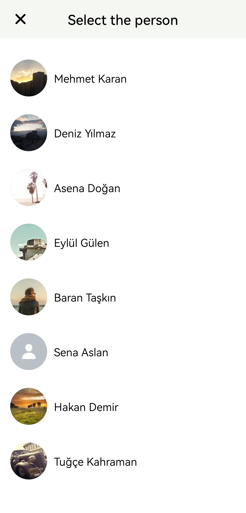</kbd>
<kbd>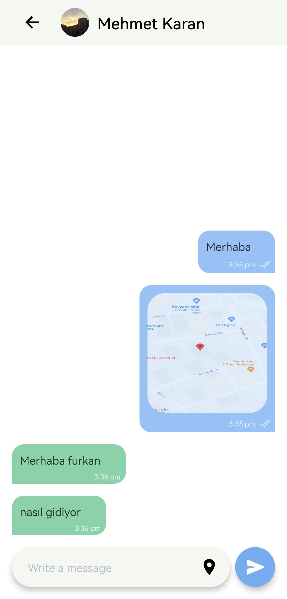</kbd>
</div>
<div>
<kbd>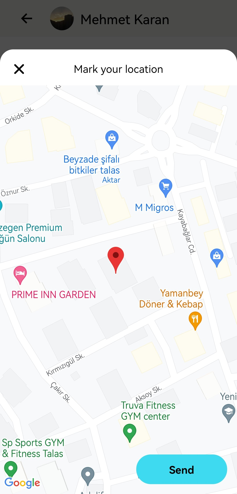</kbd>
<kbd>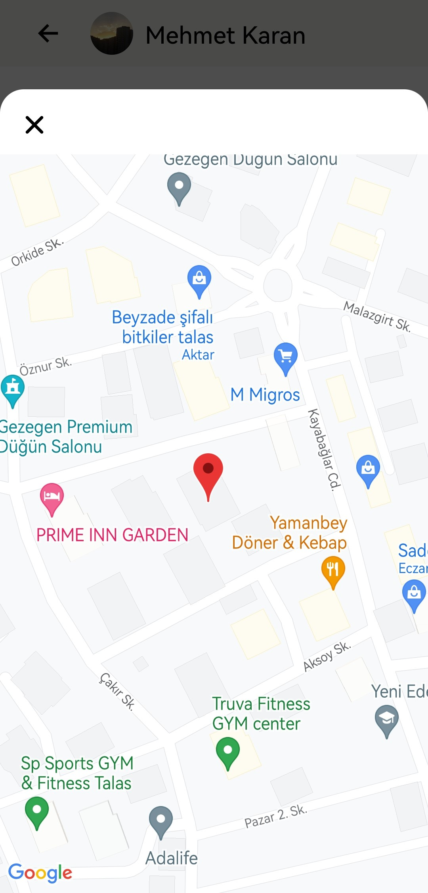</kbd>
<kbd>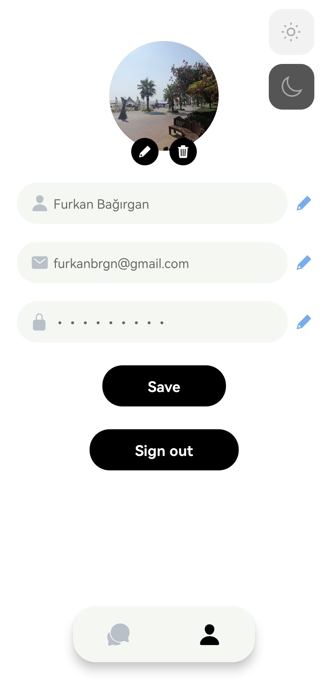</kbd>
</div>
<div>
<kbd>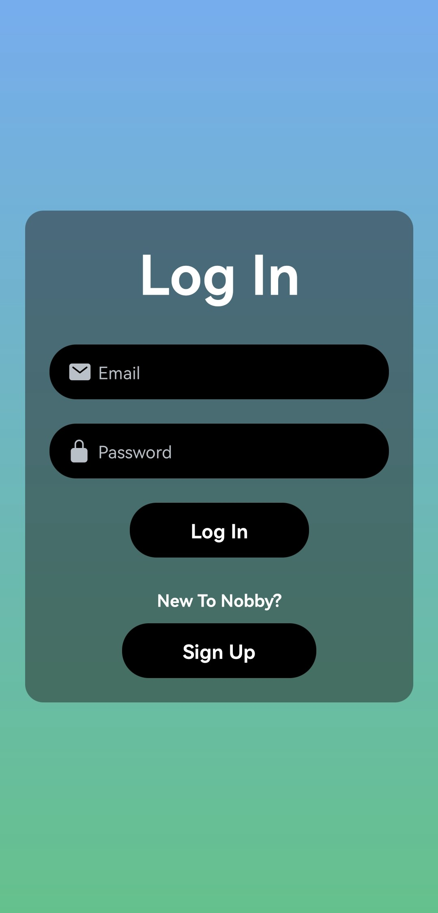</kbd>
<kbd>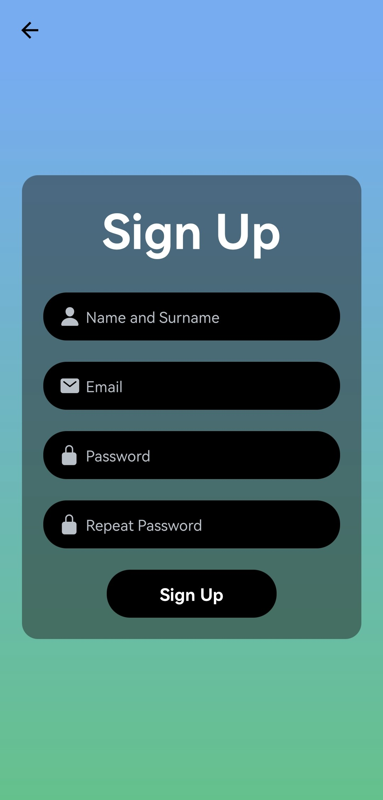</kbd>
<kbd>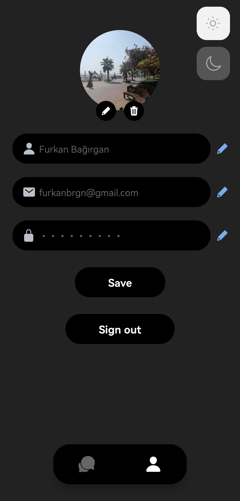</kbd>
</div>
<div>
<kbd>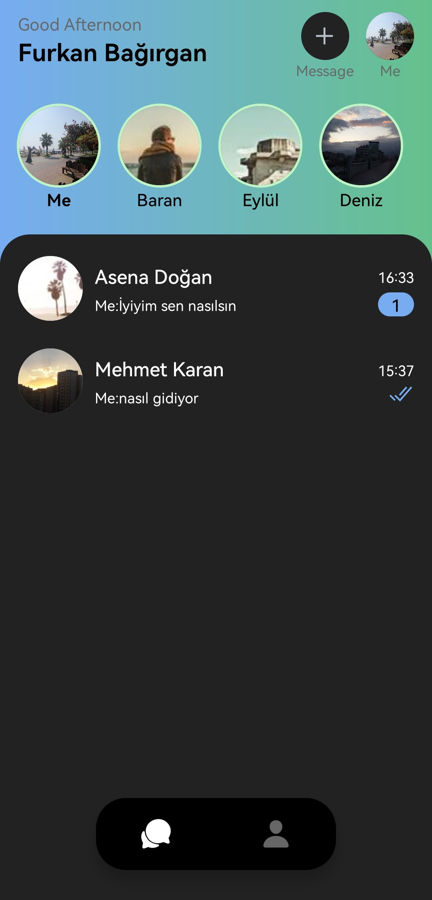</kbd>
<kbd>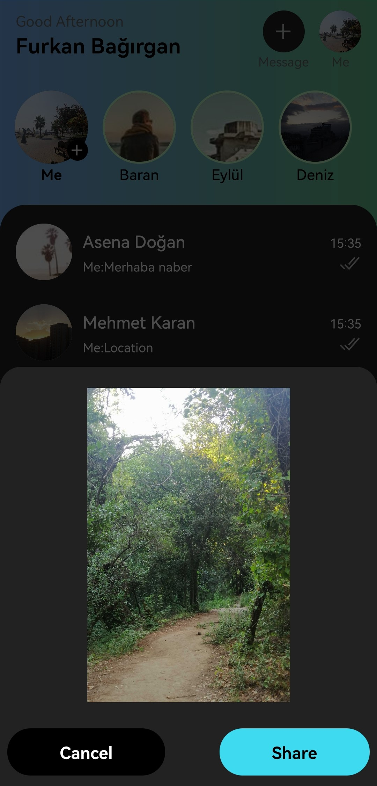</kbd>
<kbd>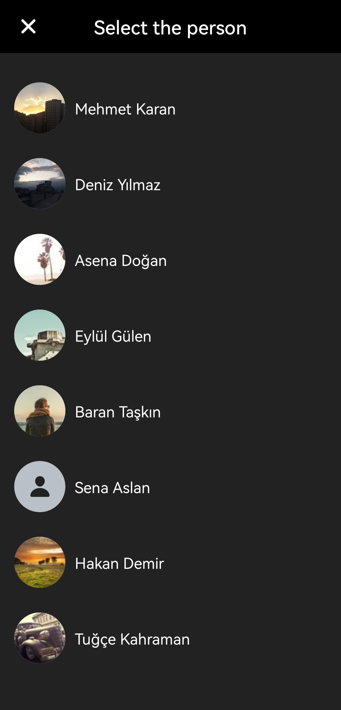</kbd>
</div>
<div>
<kbd>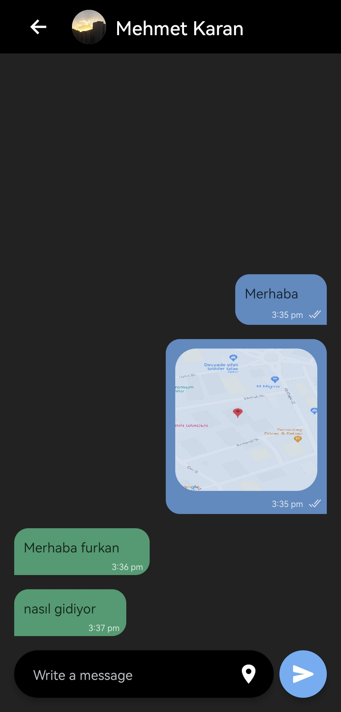</kbd>
<kbd>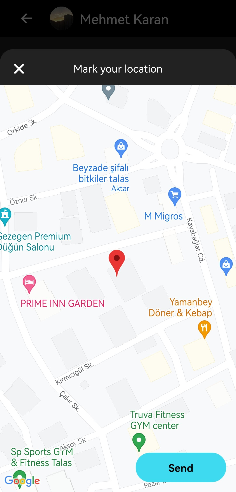</kbd>
<kbd>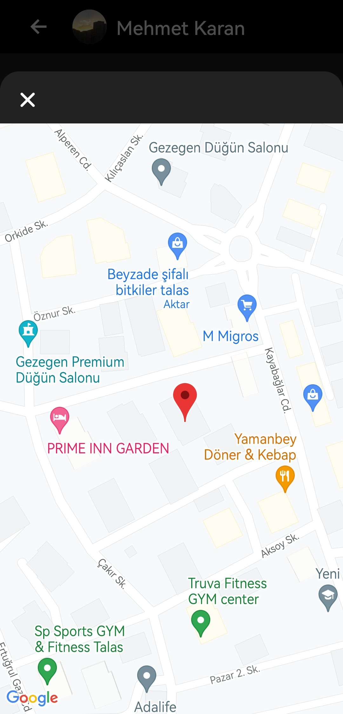</kbd>
</div>

## Installation
1.Clone Project
```
git clone https://github.com/furkanbagirgan/Nobby-Chat-App.git
```
2.Install the Necessary Packages for Project
```
npm install
or
yarn install
```
3.Run Project To Emulator or Real Device With Expo Go App
```
npx expo start | npx expo run:android
or
yarn expo start | yarn expo run:android
```
